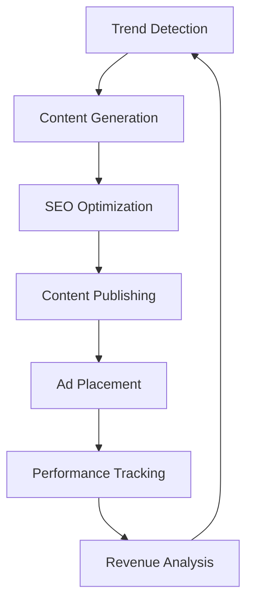
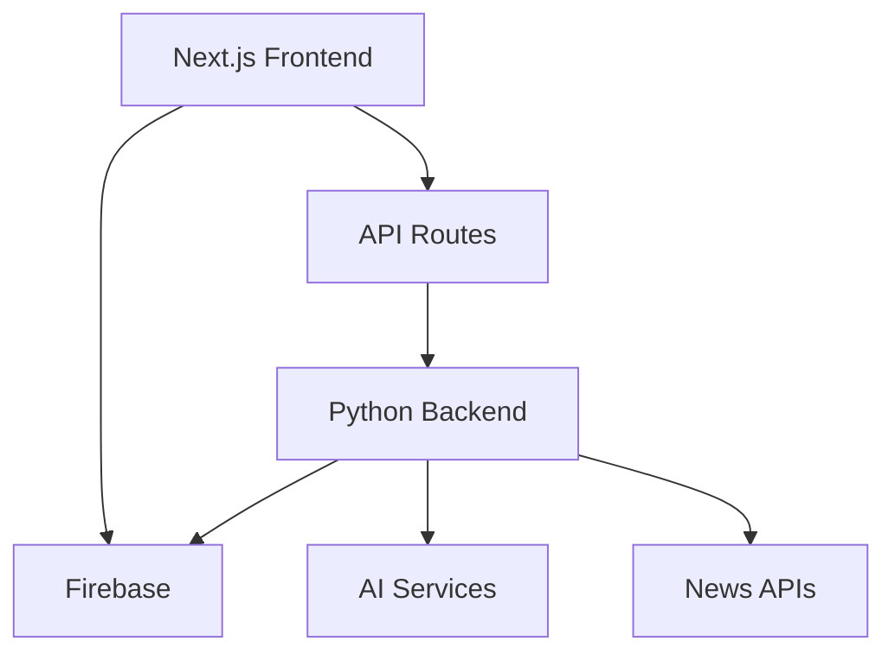

# 🌐 OminiSphere - AI-Powered News & Content Platform

<div align="center">
  
  <p><em>Automated news platform optimized for SEO and passive income generation</em></p>
</div>

[](https://nextjs.org/)
[](https://www.python.org/)
[](https://firebase.google.com/)
[](https://www.typescriptlang.org/)

## 💰 Monetization & SEO Features

### 📈 SEO Optimization
- **Automated Meta Tags**: Dynamic meta descriptions and titles for each article
- **Schema Markup**: Rich snippets for better SERP visibility
- **XML Sitemaps**: Automated sitemap generation and submission
- **URL Structure**: SEO-friendly URLs with categories and keywords
- **Content Optimization**: AI-powered keyword research and implementation
- **Mobile First**: Perfect mobile performance scores
- **Core Web Vitals**: Optimized for all performance metrics
- **Internal Linking**: Smart automatic internal link generation
- **Canonical Tags**: Proper handling of duplicate content

### 💸 Monetization Strategy
- **Google AdSense Integration**: 
  - Auto-optimized ad placements
  - A/B testing for best performing ad slots
  - Responsive ad units
  - Custom ad layouts for mobile/desktop
- **Content Monetization**:
  - High-value keyword targeting
  - Trending topic coverage
  - Niche category focus
  - Long-tail keyword optimization
- **Traffic Generation**:
  - Social media auto-posting
  - Newsletter integration
  - Push notifications
  - RSS feed optimization

### 🤖 Automation Features
- **Content Generation**:
  - AI-written articles optimized for SEO
  - Automated keyword research
  - Trending topic detection
  - Image optimization and alt text generation
  - Meta description generation
  - Title optimization for CTR
- **Publishing Schedule**:
  - Peak time posting
  - Content calendar automation
  - Category-based scheduling
  - Traffic-based content generation

## ✨ Core Features

- 🤖 **AI-Powered Content Generation**: Automated article creation using Gemini and DeepSeek AI
- 🔍 **Smart Search**: Advanced search functionality with real-time suggestions
- 📱 **Responsive Design**: Beautiful UI that works seamlessly on all devices
- 🌙 **Dark Mode**: Easy on the eyes with automatic theme switching
- 🔄 **Real-time Updates**: Live content updates with Firebase integration
- 📊 **Trending Topics**: Automatically curated trending stories
- 🎯 **Personalized Feed**: Content tailored to user interests
- 🔐 **Secure Authentication**: User authentication with Firebase
- 📂 **Content Categories**: Well-organized content by topics
- 📚 **Library System**: Save and organize favorite articles

## 🎯 SEO Implementation

### Meta Tags Structure
```html
<meta name="description" content="AI-generated description with keywords">
<meta name="keywords" content="auto-generated, trending, keywords">
<meta property="og:title" content="SEO-optimized title">
<meta property="og:description" content="Social-media optimized description">
```

### Schema Markup Example
```json
{
  "@context": "https://schema.org",
  "@type": "NewsArticle",
  "headline": "Article Title",
  "datePublished": "2024-01-20T08:00:00+08:00",
  "dateModified": "2024-01-20T09:00:00+08:00",
  "author": {
    "@type": "Person",
    "name": "Author Name"
  }
}
```

## 📊 Analytics & Tracking

- **Google Analytics 4 Integration**
- **Search Console Integration**
- **AdSense Performance Tracking**
- **Custom Performance Metrics**
- **A/B Testing Framework**

## 💹 Revenue Optimization

### Ad Placement Strategy
```typescript
const adConfig = {
  header: {
    desktop: { size: "728x90", position: "top" },
    mobile: { size: "320x50", position: "top" }
  },
  sidebar: {
    desktop: { size: "300x600", position: "right" },
    mobile: null
  },
  inContent: {
    desktop: { interval: 4, size: "468x60" },
    mobile: { interval: 6, size: "300x250" }
  }
}
```

## 📈 Performance Metrics

Track your success with:
- Daily/Monthly Active Users
- Page Views per Session
- Average Session Duration
- Bounce Rate
- Ad Revenue per 1000 Views (RPM)
- Click-Through Rate (CTR)
- Cost per Click (CPC)

## 🔄 Automated Workflows



## 🚀 Quick Start

### Prerequisites

- Node.js 16+ and npm
- Python 3.8+
- Firebase account
- Required API keys (see `.env.example`)

### Installation

1. **Clone the repository**
   ```bash
   git clone https://github.com/yourusername/ominisphere.git
   cd ominisphere
   ```

2. **Install frontend dependencies**
   ```bash
   npm install
   ```

3. **Install Python backend dependencies**
   ```bash
   cd python-backend
   pip install -r requirements.txt
   ```

4. **Set up environment variables**
   ```bash
   cp .env.example .env
   # Add your API keys and configuration
   ```

5. **Start the development servers**
   ```bash
   # Start the Next.js frontend
   npm run dev

   # In a separate terminal, start the Python backend
   python app.py
   ```

## 🏗️ Architecture



## 🔧 Configuration

### Environment Variables

Create a `.env` file with the following variables:

```env
# Firebase Configuration
NEXT_PUBLIC_FIREBASE_API_KEY=your_api_key
NEXT_PUBLIC_FIREBASE_AUTH_DOMAIN=your_domain
...

# API Keys
GEMINI_API_KEY=your_key
NEWS_API_KEY=your_key
...
```

## 🤖 Automation

The platform features automated content generation and updates:

- Trending topics updated every 30 minutes
- New articles generated hourly
- Content categorization and tagging
- Image selection and processing
- SEO optimization

## 📱 Mobile Support

OminiSphere is fully responsive and provides:

- Native-like mobile experience
- Touch-friendly interface
- Offline support with PWA
- Responsive images and layouts

## 🔒 Security

- Secure API endpoints
- Rate limiting
- Input validation
- Data encryption
- Secure authentication

## 🛠️ Development

### Commands

```bash
# Run development server
npm run dev

# Build for production
npm run build

# Run tests
npm test

# Run linting
npm run lint
```

### Project Structure

```
ominisphere/
├── app/                # Next.js app directory
├── components/         # React components
├── lib/               # Utility functions
├── public/            # Static assets
├── python-backend/    # Python API server
└── styles/            # Global styles
```

## 📄 License

This project is licensed under the MIT License - see the [LICENSE](LICENSE) file for details.

## 🤝 Contributing

Contributions are welcome! Please read our [Contributing Guide](CONTRIBUTING.md) for details.

## 📞 Support

- Documentation: [docs.ominisphere.com](https://docs.ominisphere.com)
- Email: support@ominisphere.com
- Discord: [Join our community](https://discord.gg/ominisphere)

---

<div align="center">
  <p>Made with ❤️ by the OminiSphere Team</p>
  <p><small>Optimized for maximum revenue generation</small></p>
</div> 